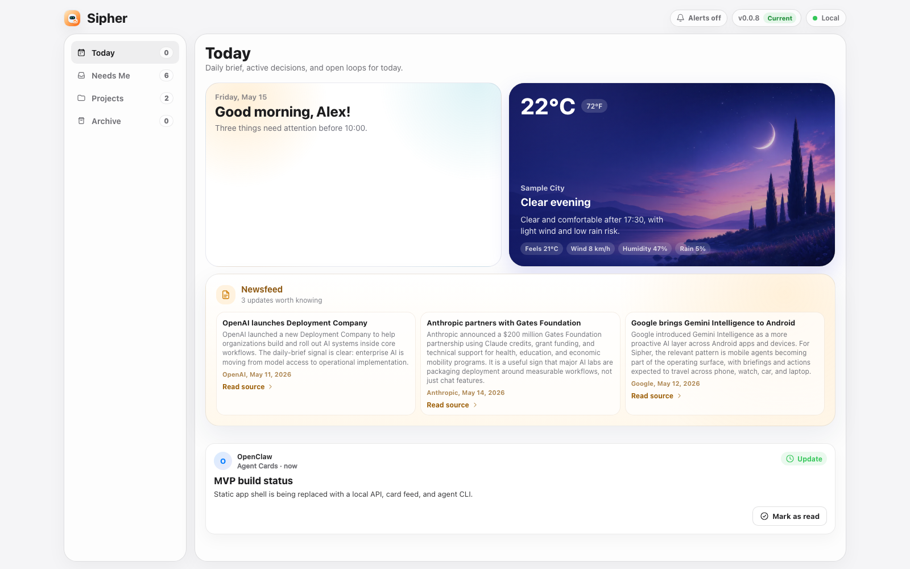
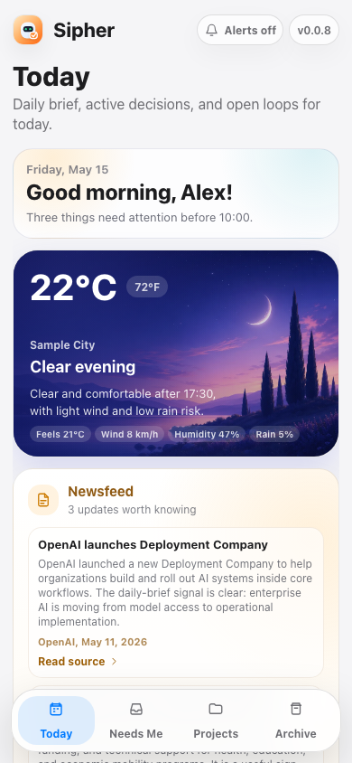
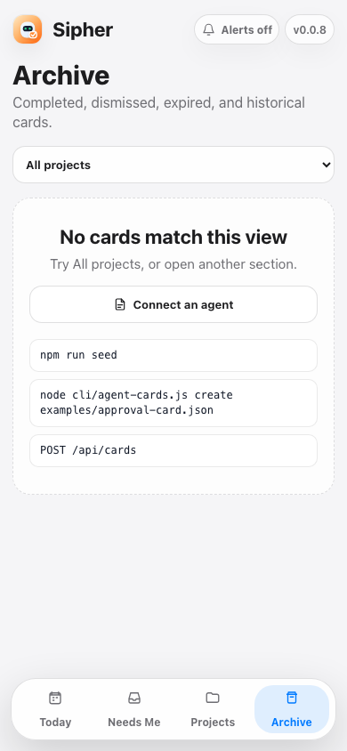

# Sipher Agent Cards

See [local approval release notes](RELEASE_NOTES.md) for review, revision, CLI, and test changes. Approval API callers must now supply the reviewed card revision.

<p align="center">
  
</p>

## iOS Preview

<table>
  <tr>
    <td align="center"></td>
    <td align="center"></td>
    <td align="center"></td>
  </tr>
  <tr>
    <td align="center"><sub>Today</sub></td>
    <td align="center"><sub>Needs Me</sub></td>
    <td align="center"><sub>Archive</sub></td>
  </tr>
</table>

[](https://nodejs.org)
[](#why-sipher)
[](LICENSE)
[](AGENT_INTEGRATION.md)

**Sipher is a local, self-hostable action feed for AI agents.** Agents create structured cards through an HTTP API or CLI; you approve, reject, answer, choose, investigate, or archive; every response becomes a structured event the agent can act on.

It is deliberately not a chat app and not arbitrary agent-generated UI. Sipher gives agents a narrow, dependable surface for the moments that need human judgment: sending an email, choosing between options, answering a blocking question, reviewing a proposed change, or scanning a morning brief.

## Why Sipher

| Problem | Sipher's answer |
| --- | --- |
| Agents bury decisions in chat scrollback | A dedicated `Needs Me` feed for pending human action |
| Approval prompts are too vague | Approval cards must include the exact draft, diff, command, recipient, risk, or attachment |
| Screenshots can come from stale local servers | `/api/version` exposes package, git, dirty state, server path, start time, request URL, and canonical URL |
| Agent output is hard to automate against | Every button press records a structured event and can call a webhook |
| Local tools need private links | Tailscale Serve is the supported private access path |

## Quick Start

Requires Node 18+.

```bash
npm install
npm start
```

Open:

```text
http://localhost:4173
```

Seed the demo feed:

```bash
npm run seed
```

Generate a richer Hermes-style simulation:

```bash
npm run simulate
```

Generate a multi-agent feed with Hermes, OpenClaw, Atlas, Calendar Agent, and Deploy Agent:

```bash
npm run simulate -- multi-agent
```

Run the basic verification path:

```bash
node --check server.js
node --check app.js
node --check cli/agent-cards.js
npm test
npm run seed
npm run list
curl http://localhost:4173/api/version
```

Versioning note: while Sipher is pre-release, package versions use `0.0.x`. Install the local pre-commit hook so each commit bumps the patch version automatically:

```bash
cp scripts/pre-commit-version.sh .git/hooks/pre-commit
```

When `/api/version` reports `updateAvailable: true`, the UI shows a yellow update bar with an `Update` button. The button runs a clean fast-forward update and restarts the local server process when possible.

## Freshness Contract

Before an agent claims Sipher is "latest", it must verify the exact URL it is showing:

```bash
curl "$AGENT_CARDS_URL/api/version"
```

If `AGENT_CARDS_URL` is unset, use the browser URL itself. Do not verify `localhost` and then show a Tailscale/IP URL.

`/api/version` returns:

```json
{
  "app": "agent-cards",
  "currentVersion": "0.1.0",
  "sourceId": "0.1.0+ae254a4.dirty",
  "latest": true,
  "updateAvailable": false,
  "stale": false,
  "canonicalUrl": "https://machine.tailnet.ts.net",
  "requestUrl": "https://machine.tailnet.ts.net",
  "servedFrom": "/path/to/sipher.oc",
  "serverStartedAt": "2026-05-13T12:00:00.000Z",
  "git": {
    "branch": "main",
    "shortCommit": "ae254a4",
    "dirty": true,
    "upstream": "origin/main",
    "behind": 0
  }
}
```

Agent rules:

- `latest: true` means the exact URL is serving the current known checkout.
- `stale: true` means the URL is not canonical. Do not call it latest.
- `updateAvailable: true` means the package version or git checkout is behind.
- Missing `/api/version`, `404`, or invalid JSON means the instance is stale or not Sipher.
- `git.dirty: true` means "latest local working tree", not "latest committed version".

Configure the canonical private URL when exposing Sipher through Tailscale:

```bash
AGENT_CARDS_CANONICAL_URL="https://<machine-name>.<tailnet-name>.ts.net" npm start
```

## Private Access With Tailscale

Use Tailscale Serve when Sipher should be available from your phone, tablet, or another tailnet-connected machine. This is required for a useful phone/Home Screen workflow: `localhost` only works on the Mac running Sipher, so agents must not send `http://localhost:4173` to the user.

```bash
npm start
tailscale serve --bg 4173
tailscale serve status
```

Set the printed HTTPS URL for agents:

```bash
export AGENT_CARDS_URL="https://<machine-name>.<tailnet-name>.ts.net"
export AGENT_CARDS_CANONICAL_URL="$AGENT_CARDS_URL"
```

Verify the exact private URL before sharing it:

```bash
curl -fsS "$AGENT_CARDS_URL/api/version"
```

The persistent user-facing link is:

```text
https://<machine-name>.<tailnet-name>.ts.net/?view=today
```

Agents should send that link, not localhost. Markdown and HTML examples:

```md
[Open Sipher](https://<machine-name>.<tailnet-name>.ts.net/?view=today)
```

```html
<a href="https://<machine-name>.<tailnet-name>.ts.net/?view=today">Open Sipher</a>
```

Operational rule: keep Tailscale Funnel off until Sipher has app-level authentication and action protection. Use tailnet-only Tailscale Serve for the private daily-use link.

### Add To Home Screen

On iPhone or iPad:

1. Make sure the device is connected to the same Tailscale tailnet.
2. Open Safari.
3. Visit `https://<machine-name>.<tailnet-name>.ts.net/?view=today`.
4. Tap Share.
5. Tap Add to Home Screen.
6. Keep the name `Sipher`, then tap Add.

Sipher already includes the required Home Screen icon assets and tags:

- `apple-touch-icon.png` for iOS Home Screen.
- `icon-192.png` and `icon-512.png` for the web app manifest.
- `manifest.webmanifest` with `display: "standalone"` and `start_url: "/?view=today"`.
- `index.html` links for `apple-touch-icon`, favicon, and manifest.

If the icon does not appear, verify these URLs through the Tailscale URL, not localhost:

```bash
curl -I "$AGENT_CARDS_URL/apple-touch-icon.png"
curl -I "$AGENT_CARDS_URL/icon-192.png"
curl -I "$AGENT_CARDS_URL/manifest.webmanifest"
```

## CLI

```bash
node cli/agent-cards.js seed
node cli/agent-cards.js simulate realistic
node cli/agent-cards.js simulate multi-agent
node cli/agent-cards.js simulate edge
node cli/agent-cards.js simulate list
node cli/agent-cards.js list
node cli/agent-cards.js show <card-id>
node cli/agent-cards.js reset --yes
node cli/agent-cards.js create examples/approval-card.json
node cli/agent-cards.js create examples/choice-card.json
node cli/agent-cards.js create examples/multi-agent-briefing.json
node cli/agent-cards.js create examples/openclaw-comparison-card.json
node cli/agent-cards.js create examples/deploy-approval-card.json
node cli/agent-cards.js update <card-id> patch.json
node cli/agent-cards.js action demo_send_email send
node cli/agent-cards.js delete <card-id>
```

Reset is intentionally an agent/operator command, not a primary user control in the UI.

Set `AGENT_CARDS_URL` when the API is not on `http://localhost:4173`.

## HTTP API

Create a card:

```bash
curl -X POST http://localhost:4173/api/cards \
  -H 'content-type: application/json' \
  -d @examples/approval-card.json
```

List cards and events:

```bash
curl http://localhost:4173/api/cards
```

View one card:

```bash
curl http://localhost:4173/api/cards/<card-id>
```

Patch a card:

```bash
curl -X PATCH http://localhost:4173/api/cards/<card-id> \
  -H 'content-type: application/json' \
  -d '{"summary":"Updated by the agent","priority":"high"}'
```

Delete a card that was created in error:

```bash
curl -X DELETE http://localhost:4173/api/cards/<card-id>
```

Reset local cards and event history:

```bash
curl -X POST http://localhost:4173/api/cards/reset
```

Check freshness:

```bash
curl http://localhost:4173/api/version
```

Record an action:

```bash
curl -X POST http://localhost:4173/api/cards/<card-id>/actions \
  -H 'content-type: application/json' \
  -d '{"action":"approve","payload":{"source":"cli"}}'
```

If a card includes `callbackUrl`, Sipher posts `{ card, event }` after an action is recorded.

Agent control summary:

- Add cards with `POST /api/cards`.
- Read the feed with `GET /api/cards` and one card with `GET /api/cards/<card-id>`.
- Update existing cards with `PATCH /api/cards/<card-id>`.
- Remove cards created in error with `DELETE /api/cards/<card-id>`.
- Archive normal completed/cleared cards by recording action `archive`.
- Enable or disable Today native cards by patching the daily brief card's `metadata.dailyBrief.cards` entries.

## Card Schema

Core fields:

- `type`: `approval`, `email_approval`, `choice`, `question`, `status`, `checklist`, `briefing`, or `comparison`
- `title`: short user-facing title
- `summary`: concise action context
- `details`: optional deeper review context
- `priority`: required `low`, `medium`, or `high`
- `neededAt`: optional ISO timestamp for when the human should act by; Needs Me sorts by this first

Use `choice` for a simple pick from similar options. Use `comparison` when the agent has evaluated tradeoffs, costs, risks, or recommends one path.
- `project`: grouping label
- `agent`: `{ "id": "hermes", "name": "Hermes", "avatarUrl": "/assets/hermes-avatar.svg" }`; if no image is provided or it fails to load, Sipher shows the first letter of `agent.name`
- `actions`: buttons such as approve, reject, edit, send, investigate
- `options`: choice-card options
- `input`: question-card input metadata
- `items`: briefing-card bullet items
- `callbackUrl`: optional webhook for structured feedback events
- `expiresAt`: optional ISO timestamp for time-sensitive cards
- `metadata`: agent-owned structured context

When `expiresAt` passes, Sipher marks unresolved cards `expired`, records an `expired` event, and moves them out of Needs Me into Archive. Use it for calendar conflicts, stale drafts, booking/pricing decisions, and daily briefs.

Approval cards must be reviewable. If an agent asks you to approve an email, file change, command, purchase, publish action, or scheduling action, it must include the exact content being approved in `details` or `metadata`.

See [AGENT_INTEGRATION.md](AGENT_INTEGRATION.md) for payload examples and lifecycle rules.

## Today Native Cards

The `Today` view is curated by the daily brief card. Agents should create or patch one `briefing` card with `project: "Daily Brief"` and put Today-native cards in `metadata.dailyBrief.cards`.

Supported native card ids:

- `weather`
- `priorities`
- `newsfeed`
- `focus`
- `email`
- `calendar`
- `openItems`

If `metadata.dailyBrief.cards` is present, Sipher renders only entries with `"enabled": true`. If it is omitted, Sipher falls back to legacy `metadata.dailyBrief.weather`, `emails`, `calendar`, `openItems`, `projects`, and `news/newsfeed` fields.

Weather card data can include `tempC`, `tempF`, `unit`, `condition`, `timeOfDay`, `feelsLike`, `wind`, `humidity`, and `rainChance`. Sipher chooses the generated weather image from `condition + timeOfDay`, keeps temperature/location/text as live UI, and renders the requested unit plus the alternate unit when available.

Today priorities should represent items that must be handled today. Put a real `neededAt`, `dueAt`, or `dueDate` on linked cards or priority items; undated action cards belong in `Needs Me`, not Today.

## Testing

The suite is intentionally split:

```bash
npm run test:static
npm run test:today
npm test
```

`test:static` checks generated weather asset coverage and key responsive CSS contracts. `test:today` starts an isolated Playwright server on port `4174` using `/tmp/sipher-agent-cards-playwright.json`, so browser tests do not mutate the live local feed. It covers agent workflows, API error paths, Today card enable/disable behavior, individual delete behavior, and weather layout across desktop/mobile scenarios.

## Publication Checklist

Before making a fork, branch, or repository public:

- Keep `.env` local. Publish only `.env.example`, which contains variable names and no secrets.
- Keep `data/agent-cards*.json`, `output/`, `test-results/`, and `archive/` out of git.
- Use generic demo names and `.example` email addresses in `examples/`, `simulations/`, tests, and screenshots.
- Regenerate README screenshots from sanitized demo data before publishing UI changes.
- If a branch was previously pushed with private screenshots or personal demo data, squash-merge a clean commit and delete the old branch before making the repo public.

## Multi-Agent Example

Sipher is designed for a shared agent feed. Hermes can summarize the morning, OpenClaw can ask for an architecture decision, Atlas can report implementation progress, Calendar Agent can ask for a scheduling preference, and Deploy Agent can request production approval.

The bundled multi-agent simulation creates that full pattern:

```bash
node cli/agent-cards.js simulate multi-agent
```

The examples are intentionally copyable:

- [multi-agent-briefing.json](examples/multi-agent-briefing.json): Hermes summary card with `metadata.sourceCards`
- [openclaw-comparison-card.json](examples/openclaw-comparison-card.json): OpenClaw decision card with structured options
- [deploy-approval-card.json](examples/deploy-approval-card.json): Deploy Agent approval card with checks, release note, rollback, and risks

Agent rule of thumb: one card has one primary owner in `agent`; cross-agent context belongs in `metadata.contributors` or `metadata.sourceCards`.

To onboard an agent, start with [SIPHER_AGENT_PROMPT.md](SIPHER_AGENT_PROMPT.md). It tells agents what belongs in Sipher, what to avoid, how to batch approvals, and how to close the loop after a user decision.

## Implemented MVP

- Mobile-first PWA-style web app
- Needs Me, Today, Projects, Archive views
- Approval, choice, question, status, briefing, and comparison cards
- Tap actions, option selection, and text answers
- Local JSON persistence in `data/agent-cards.json`
- Structured event history
- Callback webhook hook
- Agent CLI with create, list, show, update, action, delete, seed, reset, and simulation commands
- Curated Today native cards controlled by `metadata.dailyBrief.cards`
- Generated responsive weather imagery for clear, cloudy, rainy, stormy, hazy, and snowy states
- Playwright and Node test suites for weather layout, agent workflow, and API error paths
- Version/freshness metadata for agent verification

## Project Shape

```text
index.html                  App shell
style.css                   Responsive product UI
app.js                      Browser state, rendering, and interactions
server.js                   Dependency-free Node HTTP API and static server
cli/agent-cards.js          Agent-facing CLI
examples/*.json             Example card payloads
simulations/*.json          Realistic and edge-case agent fixtures
AGENT_INTEGRATION.md        Contract agents must follow
```

## License

MIT. See [LICENSE](LICENSE).
