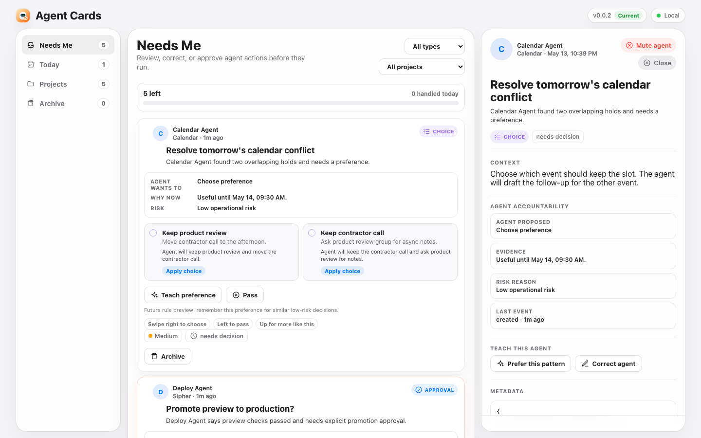

# Sipher Agent Cards



[](https://nodejs.org)
[](#why-sipher)
[](LICENSE)
[](AGENT_INTEGRATION.md)

**Sipher is a local, self-hostable action feed for AI agents.** Agents create structured cards through an HTTP API or CLI; you approve, reject, answer, choose, investigate, or archive; every response becomes a structured event the agent can act on.

It is deliberately not a chat app and not arbitrary agent-generated UI. Sipher gives agents a narrow, dependable surface for the moments that need human judgment: sending an email, choosing between options, answering a blocking question, reviewing a proposed change, or scanning a morning brief.

## Why Sipher

| Problem | Sipher's answer |
| --- | --- |
| Agents bury decisions in chat scrollback | A dedicated `Needs Me` feed for pending human action |
| Approval prompts are too vague | Approval cards must include the exact draft, diff, command, recipient, risk, or attachment |
| Screenshots can come from stale local servers | `/api/version` exposes package, git, dirty state, server path, start time, request URL, and canonical URL |
| Agent output is hard to automate against | Every button press records a structured event and can call a webhook |
| Local tools need private links | Tailscale Serve is the supported private access path |

## Quick Start

Requires Node 18+.

```bash
npm install
npm start
```

Open:

```text
http://localhost:4173
```

Seed the demo feed:

```bash
npm run seed
```

Generate a richer Hermes-style simulation:

```bash
npm run simulate
```

Generate a multi-agent feed with Hermes, OpenClaw, Atlas, Calendar Agent, and Deploy Agent:

```bash
npm run simulate -- multi-agent
```

Run the basic verification path:

```bash
node --check server.js
node --check app.js
node --check cli/agent-cards.js
npm run seed
npm run list
curl http://localhost:4173/api/version
```

## Freshness Contract

Before an agent claims Sipher is "latest", it must verify the exact URL it is showing:

```bash
curl "$AGENT_CARDS_URL/api/version"
```

If `AGENT_CARDS_URL` is unset, use the browser URL itself. Do not verify `localhost` and then show a Tailscale/IP URL.

`/api/version` returns:

```json
{
  "app": "agent-cards",
  "currentVersion": "0.1.0",
  "sourceId": "0.1.0+ae254a4.dirty",
  "latest": true,
  "updateAvailable": false,
  "stale": false,
  "canonicalUrl": "https://machine.tailnet.ts.net",
  "requestUrl": "https://machine.tailnet.ts.net",
  "servedFrom": "/path/to/sipher.oc",
  "serverStartedAt": "2026-05-13T12:00:00.000Z",
  "git": {
    "branch": "main",
    "shortCommit": "ae254a4",
    "dirty": true,
    "upstream": "origin/main",
    "behind": 0
  }
}
```

Agent rules:

- `latest: true` means the exact URL is serving the current known checkout.
- `stale: true` means the URL is not canonical. Do not call it latest.
- `updateAvailable: true` means the package version or git checkout is behind.
- Missing `/api/version`, `404`, or invalid JSON means the instance is stale or not Sipher.
- `git.dirty: true` means "latest local working tree", not "latest committed version".

Configure the canonical private URL when exposing Sipher through Tailscale:

```bash
AGENT_CARDS_CANONICAL_URL="https://<machine-name>.<tailnet-name>.ts.net" npm start
```

## Private Access With Tailscale

Use Tailscale Serve when Sipher should be available from your phone, tablet, or another tailnet-connected machine.

```bash
npm start
tailscale serve --bg 4173
tailscale serve status
```

Set the printed HTTPS URL for agents:

```bash
export AGENT_CARDS_URL="https://<machine-name>.<tailnet-name>.ts.net"
export AGENT_CARDS_CANONICAL_URL="$AGENT_CARDS_URL"
```

Operational rule: keep Tailscale Funnel off until Sipher has app-level authentication and action protection.

## CLI

```bash
node cli/agent-cards.js seed
node cli/agent-cards.js simulate realistic
node cli/agent-cards.js simulate multi-agent
node cli/agent-cards.js simulate edge
node cli/agent-cards.js simulate list
node cli/agent-cards.js list
node cli/agent-cards.js create examples/approval-card.json
node cli/agent-cards.js create examples/choice-card.json
node cli/agent-cards.js create examples/multi-agent-briefing.json
node cli/agent-cards.js create examples/openclaw-comparison-card.json
node cli/agent-cards.js create examples/deploy-approval-card.json
node cli/agent-cards.js action demo_send_email send
```

Set `AGENT_CARDS_URL` when the API is not on `http://localhost:4173`.

## HTTP API

Create a card:

```bash
curl -X POST http://localhost:4173/api/cards \
  -H 'content-type: application/json' \
  -d @examples/approval-card.json
```

List cards and events:

```bash
curl http://localhost:4173/api/cards
```

Check freshness:

```bash
curl http://localhost:4173/api/version
```

Record an action:

```bash
curl -X POST http://localhost:4173/api/cards/<card-id>/actions \
  -H 'content-type: application/json' \
  -d '{"action":"approve","payload":{"source":"cli"}}'
```

If a card includes `callbackUrl`, Sipher posts `{ card, event }` after an action is recorded.

## Card Schema

Core fields:

- `type`: `approval`, `choice`, `question`, `status`, `briefing`, or `comparison`
- `title`: short user-facing title
- `summary`: concise action context
- `details`: optional deeper review context
- `priority`: `low`, `medium`, or `high`
- `project`: grouping label
- `agent`: `{ "id": "hermes", "name": "Hermes", "avatarUrl": "/assets/hermes-avatar.svg" }`
- `actions`: buttons such as approve, reject, edit, send, investigate
- `options`: choice-card options
- `input`: question-card input metadata
- `items`: briefing-card bullet items
- `callbackUrl`: optional webhook for structured feedback events
- `metadata`: agent-owned structured context

Approval cards must be reviewable. If an agent asks you to approve an email, file change, command, purchase, publish action, or scheduling action, it must include the exact content being approved in `details` or `metadata`.

See [AGENT_INTEGRATION.md](AGENT_INTEGRATION.md) for payload examples and lifecycle rules.

## Multi-Agent Example

Sipher is designed for a shared agent feed. Hermes can summarize the morning, OpenClaw can ask for an architecture decision, Atlas can report implementation progress, Calendar Agent can ask for a scheduling preference, and Deploy Agent can request production approval.

The bundled multi-agent simulation creates that full pattern:

```bash
node cli/agent-cards.js simulate multi-agent
```

The examples are intentionally copyable:

- [multi-agent-briefing.json](examples/multi-agent-briefing.json): Hermes summary card with `metadata.sourceCards`
- [openclaw-comparison-card.json](examples/openclaw-comparison-card.json): OpenClaw decision card with structured options
- [deploy-approval-card.json](examples/deploy-approval-card.json): Deploy Agent approval card with checks, release note, rollback, and risks

Agent rule of thumb: one card has one primary owner in `agent`; cross-agent context belongs in `metadata.contributors` or `metadata.sourceCards`.

## Implemented MVP

- Mobile-first PWA-style web app
- Needs Me, Today, Projects, Archive views
- Approval, choice, question, status, briefing, and comparison cards
- Tap actions, option selection, and text answers
- Local JSON persistence in `data/agent-cards.json`
- Structured event history
- Callback webhook hook
- Agent CLI, examples, and simulation fixtures
- Version/freshness metadata for agent verification

## Project Shape

```text
index.html                  App shell
style.css                   Responsive product UI
app.js                      Browser state, rendering, and interactions
server.js                   Dependency-free Node HTTP API and static server
cli/agent-cards.js          Agent-facing CLI
examples/*.json             Example card payloads
simulations/*.json          Realistic and edge-case agent fixtures
AGENT_INTEGRATION.md        Contract agents must follow
```

## License

MIT. See [LICENSE](LICENSE).
